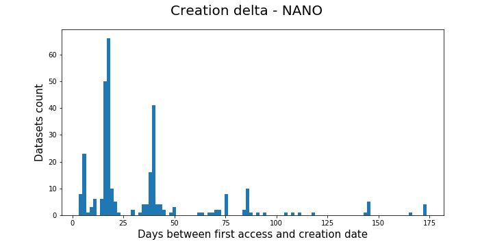
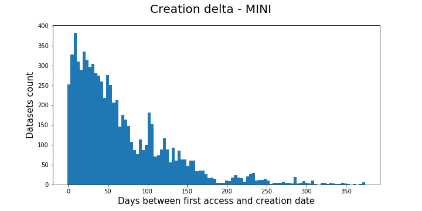
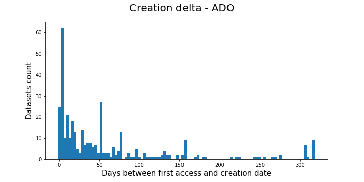
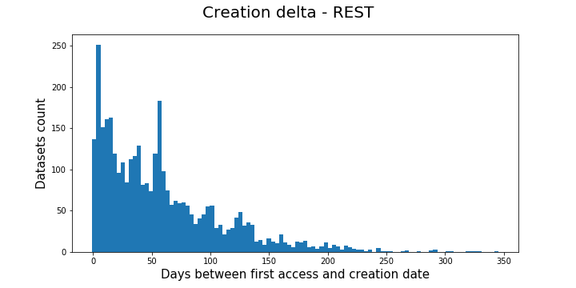
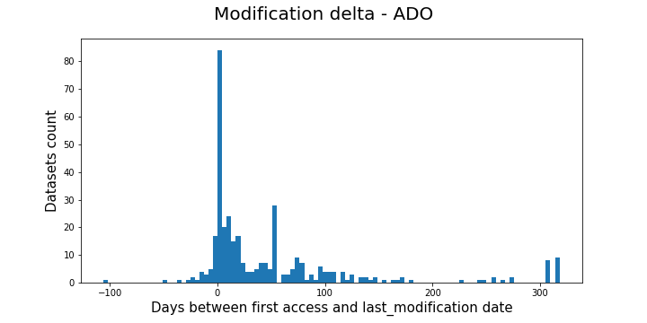
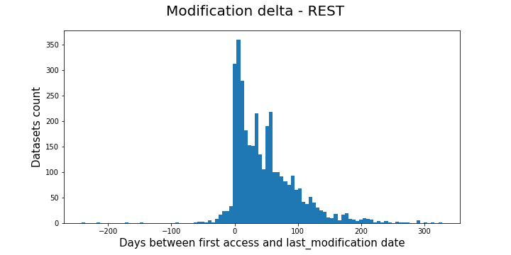

# DeltaT

**deltaT** is a range in time after the creation of a dataset in which we
assume the dataset will stay in disk regardless whether it has been accessed or not
and/or the deletion policy in place. It will be calculated as the typical time
between the creation(d_creation_date) or modification(d_last_modification) date
of a dataset and its first access. Following, the procedure to define **deltaT**
is described.

**dataset_dates_df**. This DataFrame contains three fields:
'd_dataset_id', 'd_creation_date' and 'd_last_modification_date', it
holds information about the creation and last modification dates of each
of the datasets according to DBS. The code to produce this DataFrame is here:
https://github.com/ddavila0/analytics_tools/blob/master/models/spark/get_dataset_dates.py
    

## The algorithm to calculate **deltaT**

First, two DataFrames are used as input data:
 * **dataset_dates_df**. It ccontains three fields:
 'd_dataset_id', 'd_creation_date' and 'd_last_modification_date', it
 holds information about the creation and last modification dates of each
 of the datasets according to DBS. The code to produce this DataFrame is here:
 https://github.com/ddavila0/analytics_tools/blob/master/models/spark/get_dataset_dates.py

|d_dataset_id  |d_creation_date  |d_last_modification_date
|--------------|-----------------|------------------------
|    13552523  |   1.524251e+09  |            1.524304e+09
|    13552539  |   1.524248e+09  |            1.524534e+09
|    13552774  |   1.524304e+09  |            1.524534e+09
|    13553161  |   1.524394e+09  |            1.524521e+09
|    13553167  |   1.524359e+09  |            1.524521e+09
|**dataset_dates_df**
 
* **days_df**. Each record on this DataFrame has a week timestamp, 'week_ts', a day timestamp
 'day_ts' and the set of dataset IDs that were accessed that day 'datasets_set'.
 More information about this DataFrame can be found here:
 [The origin of days_df](input_data.md#the-origin-of-days-dataframe)

|week_ts	   | day_ts	        |datasets_set
|--------------|----------------|-------------------------------------------------
|1.527725e+09  | 1.527811e+09	|{13552539}
|1.527725e+09  | 1.528070e+09	|{13552774, 13553161, 13552523, 13553167, 13552...}
|1.527725e+09  | 1.528157e+09	|{13503969, 13504003, 13504008, 13503945, 13503...}
|1.528330e+09  | 1.528589e+09	|{13553281, 13552774, 13553161, 13552523, 13553...}
|1.528330e+09  | 1.528675e+09	|{13503969, 13504003, 13504008, 13504553, 13503..}
|**days_df**

Using **days_df** we create the DataFrame **first_access_df** which has the date
of the first access observed in **days_df** for each dataset

|d_dataset_id  |first_access_day
|--------------|----------------
|    13552523  |    1.528070e+09
|    13552539  |    1.527811e+09
|    13552774  |    1.528070e+09
|    13553161  |    1.528070e+09
|    13553167  |    1.528070e+09
|**first_access_df**

Then the **all_date** DataFrame is created by combining **dataset_dates_df** and
**first_access_df** and two additional columns are inserted:
 * creation_delta_days       = first_access_day - d_creation_date
 * modification_delta_days   = first_access_day - d_last_modification_date

| d_dataset_id  |d_creation_date  |d_last_modification_date |first_access_day  |creation_delta_days  |modification_delta_days
|---------------|-----------------|-------------------------|------------------|---------------------|-----------------------
|     13552523  |   1.524251e+09  |            1.524304e+09 |     1.528070e+09 |           44.206794 |               43.597037
|     13552539  |   1.524248e+09  |            1.524534e+09 |     1.527811e+09 |           41.237488 |               37.925382
|     13552774  |   1.524304e+09  |            1.524534e+09 |     1.528070e+09 |           43.593194 |               40.924780
|     13553161  |   1.524394e+09  |            1.524521e+09 |     1.528070e+09 |           42.556620 |               41.078843
|     13553167  |   1.524359e+09  |            1.524521e+09 |     1.528070e+09 |           42.960544 |               41.078611
|**all_dates**
  
Finally we create two histograms based on the 'creation_delta_days' and
'modification_delta_days' to see what is the typical time
between the creation or modification of a dataset and its first access
to define the value of **deltaT**. See the histograms in the next section. 

## Delta histograms

The following histogram depict the time between the first access of a dataset
recorded in **days_df**(*) and either its 'creation date' or its 'last_modification_date'
as shown in DBS.

Similarly to the results in the first version of the algorithm, the datasets
have been classified in 4 categories: NANO, MINI, ADO and REST so each of the
following plots represents one of these categories.

In the X - axis it is shown the difference in days between the first access
and the creation/modification date. In the Y - axis is the count of datasets
presenting such difference.

 

 

 

 

 

 

 

 
  
  
  
  
