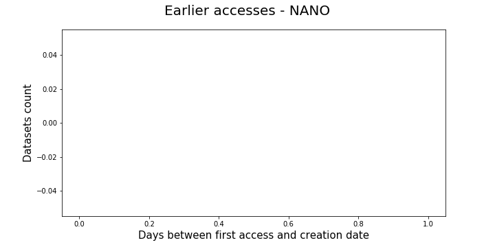
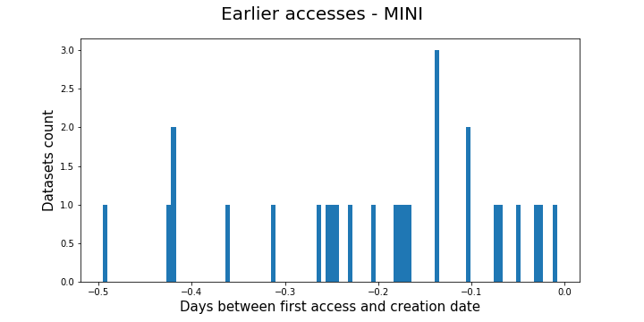
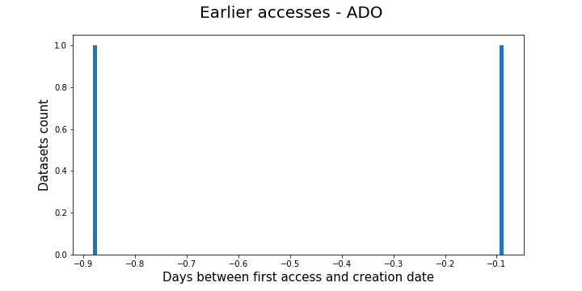
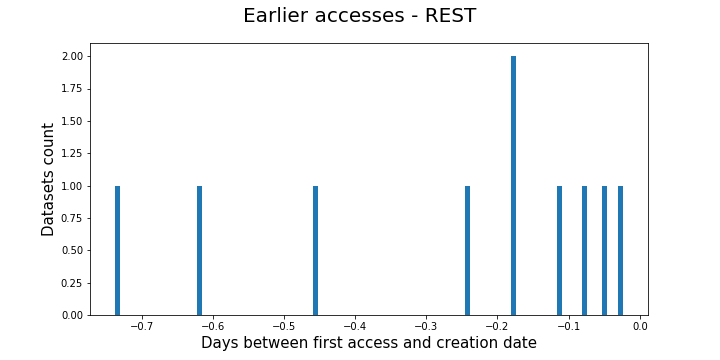

# Earlier aceess

Within the data we have found few "earlier access" cases in wich a dataset seems
to be accessed before its creatin time. This happens when a user knows in advance
of the creation of a certain dataset and he/her access it before the dataset is
officially released.

Taking into account these cases it seems reasonable to think that at the moment
of deciding whether a dataset access has to be marked as recalled or not, we should
not only look into the past to see if the dataset has been accessed or created recently
but also into the future in case we are observing an "earlier access" to the dataset
and hence, its creation is ahead in time. 

Nevertheless, when looking closely to the "earlier access" cases, we have observed that:
 1. There are very few cases like these
 1. The negative difference in time between the first access and the creation of a dataset
    is less than a day.

Below you can see the histograms representing what is described above.

Taking into account the above and the fact that we round the time accesses to the previous
week, these cases seems verly unlikely to cause an error when accounting for recalls. For this
reason these cases won't be considered within the algorithm.

 

 

 

