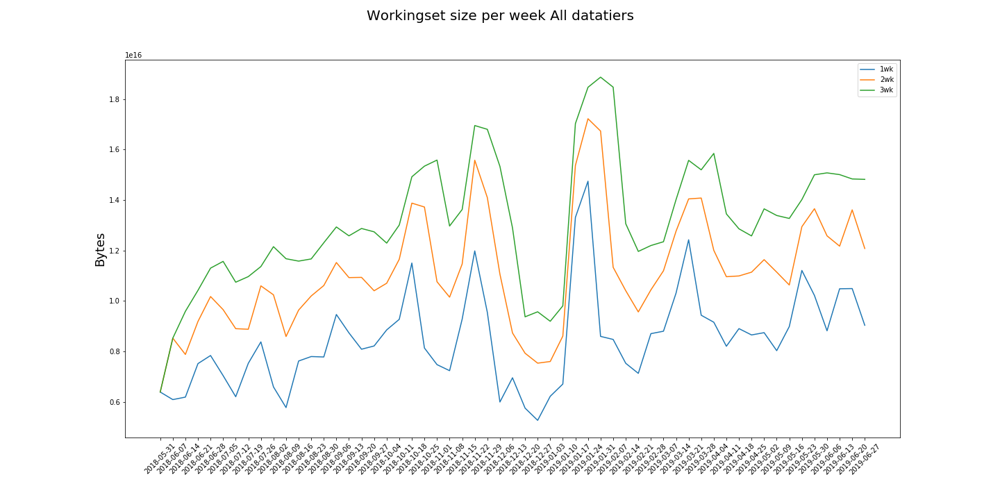

# Results

The results are presented in the format of a table that summarizes the data
produced by the algorithm and a set of three plots. 

The table has the folowing fields:
 * policy. The policy applied e.g. 2 means "Everything not used wihint the last 2 weeks gets deleted from disk"
 * max_recalled_per_day. The maximum amount of data recalled from tap on a single day
 * max_workingset_size. The maximum workingset size, i.e. the amount of disk space you would need to use this policy
 * total_recalled. Total amount of Bytes recalled from tape
 * total_freed. Tatal amount of Bytes freed from disk 

Each record in the table represents a different policy applied.

The set of plots is shown to ilustarte the following metrics:

 1. The workingset size(Bytes) or the disk space required to store the
    current working set per week, depending on the deletion policy applied
 
 2. The amount of data recalled from tape per week.

 3. The amount of data freed from disk per week.

 
All of the plots have the samae format. In the x-axis we have the different
weeks, on the y-axis we have size in Bytes and the different metrics shown
the values of the different deletion policies.

Below you can see the Results of running this algorithm on data from
June 2018 to June 2019 for three different policies. In the next
sub-sections you can see the results when the data is divide in 4
datatier categories.

policy |max_recalled_per_day |max_recalled_day |max_workingset_size |total_recalled |total_freed
-------|---------------------|-----------------|--------------------|---------------|-----------
1      | 5.47 PB             | 2019-01-22      | 14.75 PB           | 154.26 PB     | 151.62 PB 
2      | 5.37 PB             | 2019-01-22      | 17.22 PB           | 118.14 PB     | 114.59 PB 
3      | 5.35 PB             | 2019-01-22      | 18.87 PB           | 98.00 PB      | 92.77 PB  

 

 

 

