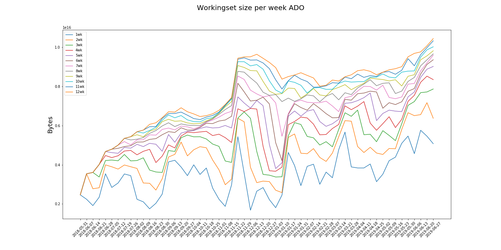
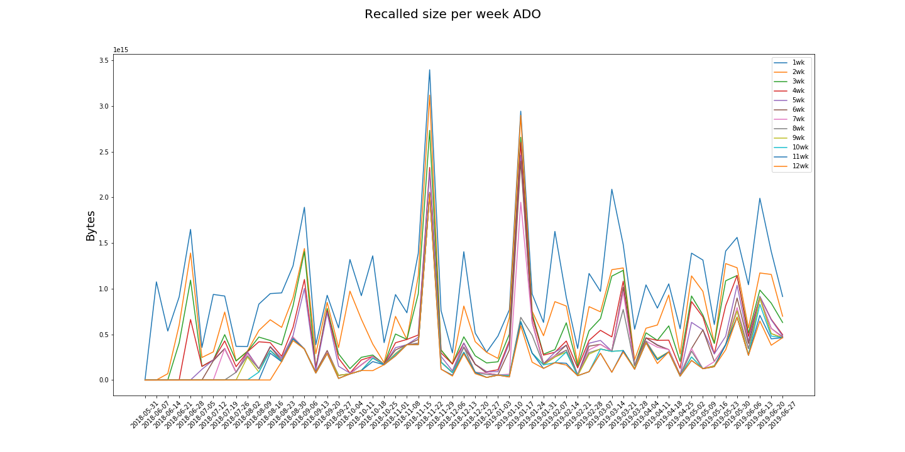
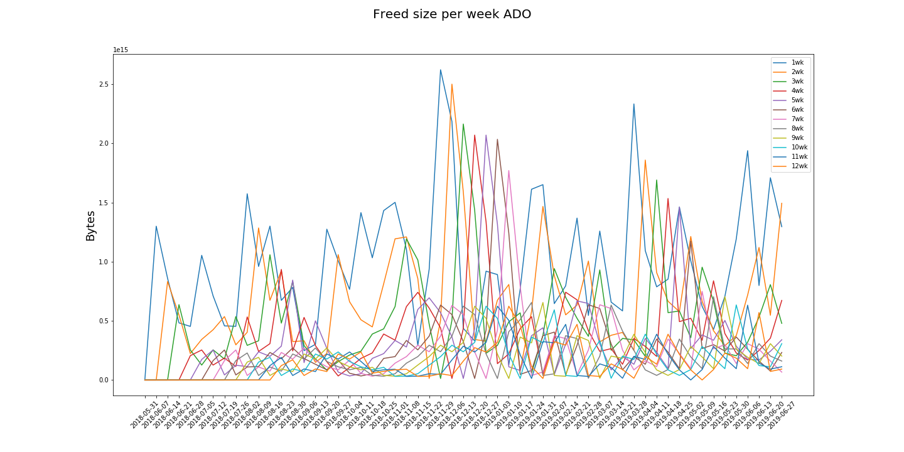

# ADO

The "ADO" category comprises the accesses to those datasets that belong to the datatier AOD.

policy |max_recalled_per_day |max_recalled_day |max_workingset_size |total_recalled |total_freed
-------|---------------------|-----------------|--------------------|---------------|-----------
1      | 1.49 PB             | 2018-11-27      | 5.76 PB            | 58.62 PB      | 56.01 PB  
2      | 1.44 PB             | 2018-11-27      | 7.17 PB            | 41.27 PB      | 38.44 PB  
3      | 1.38 PB             | 2018-11-27      | 7.87 PB            | 32.64 PB      | 28.38 PB  
4      | 1.38 PB             | 2018-11-27      | 8.52 PB            | 26.82 PB      | 22.49 PB  
5      | 1.38 PB             | 2018-11-27      | 9.02 PB            | 23.01 PB      | 18.67 PB  
6      | 1.33 PB             | 2018-11-27      | 9.36 PB            | 20.17 PB      | 15.61 PB  
7      | 1.33 PB             | 2018-11-27      | 9.59 PB            | 18.14 PB      | 13.55 PB  
8      | 1.33 PB             | 2018-11-27      | 9.66 PB            | 15.62 PB      | 11.31 PB  
9      | 1.33 PB             | 2018-11-27      | 9.82 PB            | 14.46 PB      | 10.07 PB  
10     | 1.33 PB             | 2018-11-27      | 10.02 PB           | 13.71 PB      | 9.37 PB   
11     | 1.33 PB             | 2018-11-27      | 10.33 PB           | 12.77 PB      | 8.21 PB   
12     | 1.33 PB             | 2018-11-27      | 10.44 PB           | 11.92 PB      | 7.54 PB   

 

 

 

