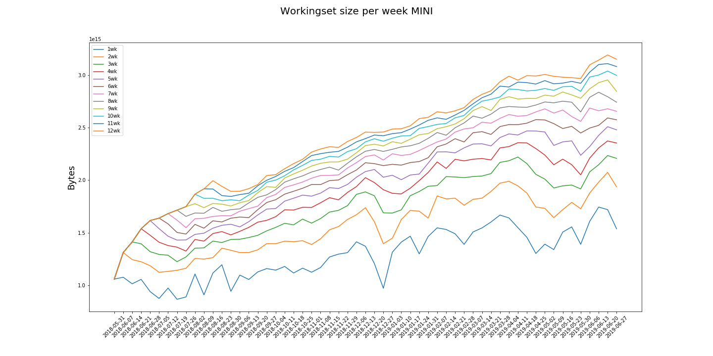
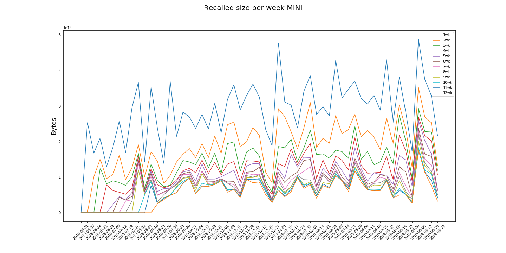
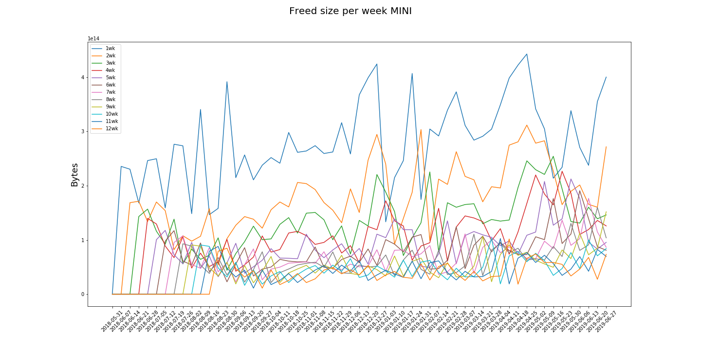

# MINI

The "MINI" category comprises the accesses to those datasets that belong to the datatiers MINIAOD and MINIAODSIM.

policy |max_recalled_per_day |max_recalled_day |max_workingset_size |total_recalled |total_freed
-------|---------------------|-----------------|--------------------|---------------|-----------
1      | 189.91 TB           | 2019-05-02      | 1.74 PB            | 16.28 PB      | 15.80 PB  
2      | 128.64 TB           | 2019-05-02      | 2.07 PB            | 10.63 PB      | 10.01 PB  
3      | 84.86 TB            | 2019-05-02      | 2.23 PB            | 8.17 PB       | 7.37 PB   
4      | 80.30 TB            | 2019-06-16      | 2.37 PB            | 6.71 PB       | 5.89 PB   
5      | 79.78 TB            | 2019-06-16      | 2.51 PB            | 5.70 PB       | 4.84 PB   
6      | 54.75 TB            | 2019-06-16      | 2.59 PB            | 5.01 PB       | 4.08 PB   
7      | 52.48 TB            | 2019-04-24      | 2.69 PB            | 4.56 PB       | 3.59 PB   
8      | 52.48 TB            | 2019-04-24      | 2.84 PB            | 4.19 PB       | 3.16 PB   
9      | 51.54 TB            | 2019-04-24      | 2.96 PB            | 3.86 PB       | 2.76 PB   
10     | 51.50 TB            | 2018-10-18      | 3.04 PB            | 3.53 PB       | 2.40 PB   
11     | 47.77 TB            | 2018-10-18      | 3.11 PB            | 3.34 PB       | 2.17 PB   
12     | 47.77 TB            | 2018-10-18      | 3.19 PB            | 3.13 PB       | 1.97 PB   

 

 

 

