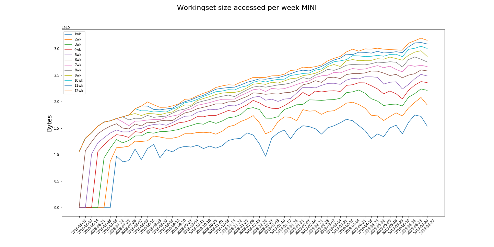
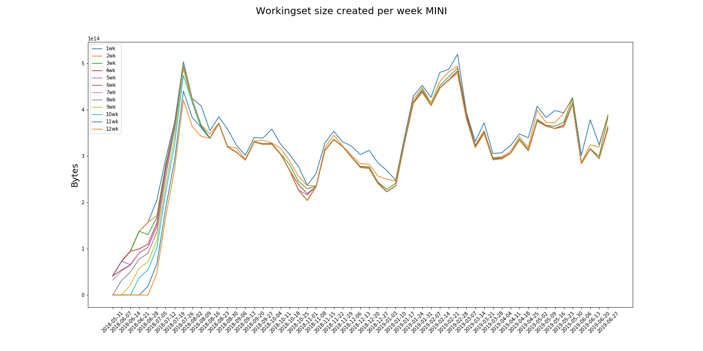
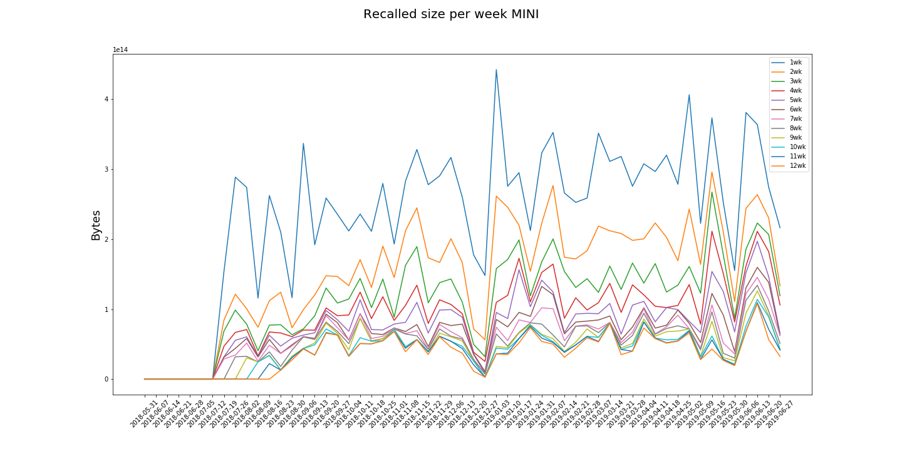
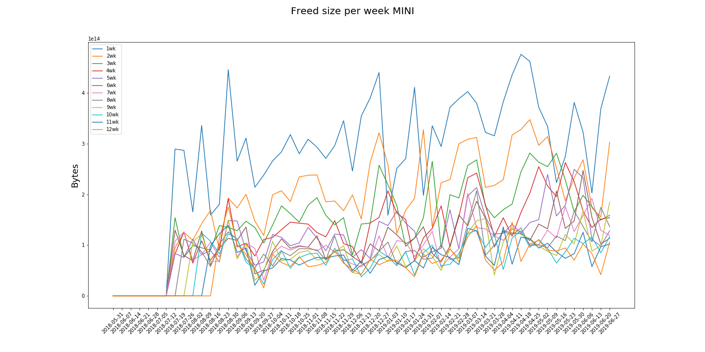
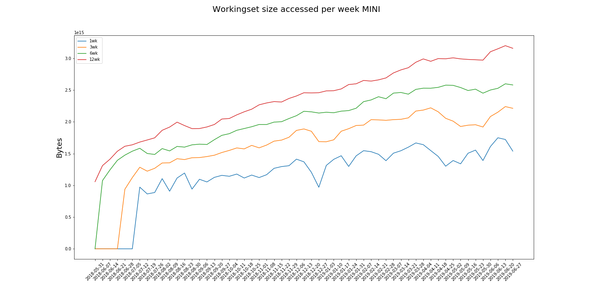
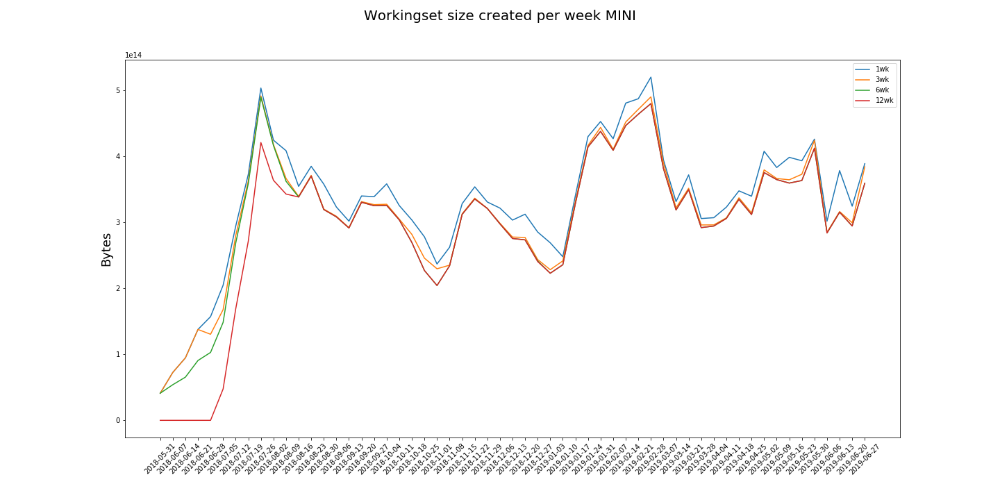
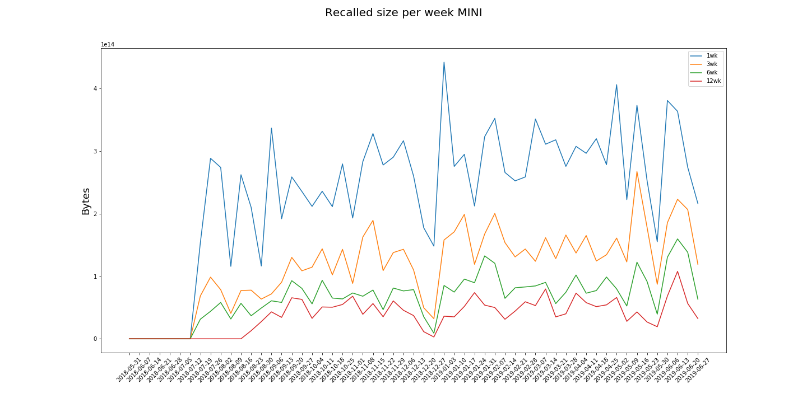
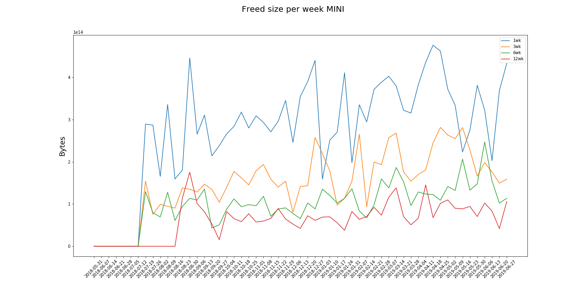

# MINI

The "MINI" category comprises the accesses to those datasets that belong to the datatiers MINIAOD and MINIAODSIM.

| policy |max_rec_day  |max_rec_day      |max_ws_c_size |max_ws_a_size |total_rec  |total_freed
|--------|-------------|-----------------|------------- |--------------|-----------|-----------
|1       |187.27 TB    |2019-05-02       |520.40 TB     |1.75 PB       |13.44 PB   |15.74 PB  
|2       |126.64 TB    |2019-05-02       |495.94 TB     |2.08 PB       |8.71 PB    |10.75 PB  
|3       |82.87 TB     |2019-05-02       |491.88 TB     |2.24 PB       |6.57 PB    |8.49 PB   
|4       |78.14 TB     |2019-06-16       |490.68 TB     |2.38 PB       |5.31 PB    |7.19 PB   
|5       |77.62 TB     |2019-06-16       |490.54 TB     |2.52 PB       |4.44 PB    |6.29 PB   
|6       |52.59 TB     |2019-06-16       |490.07 TB     |2.60 PB       |3.79 PB    |5.66 PB   
|7       |46.85 TB     |2019-06-16       |489.85 TB     |2.69 PB       |3.38 PB    |5.26 PB   
|8       |45.23 TB     |2019-04-24       |489.85 TB     |2.84 PB       |3.01 PB    |4.82 PB   
|9       |44.29 TB     |2019-04-24       |489.85 TB     |2.96 PB       |2.68 PB    |4.41 PB   
|10      |43.33 TB     |2019-03-19       |480.31 TB     |3.05 PB       |2.44 PB    |4.03 PB   
|11      |43.33 TB     |2019-03-19       |480.31 TB     |3.12 PB       |2.27 PB    |3.77 PB   
|12      |43.33 TB     |2019-03-19       |480.31 TB     |3.20 PB       |2.12 PB    |3.55 PB   

 

 

 

 

## Reduced plots 

The following plots only show policies 1, 3, 6 and 12

 

 

 

 

