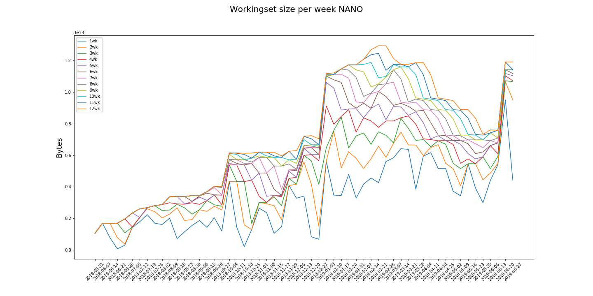
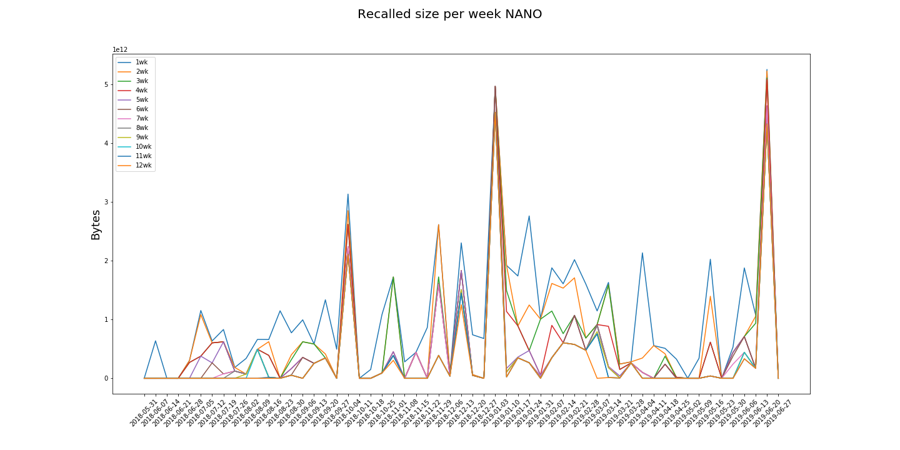
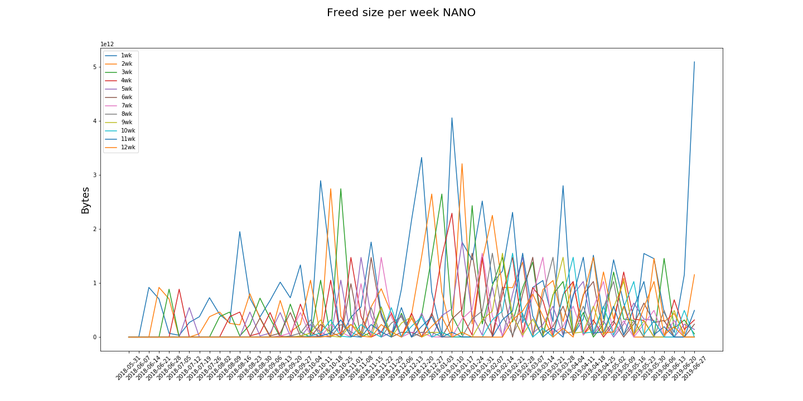

# NANO

The "NANO" category comprises the accesses to those datasets that belong to the datatier NANOAOD.

policy |max_recalled_per_day |max_recalled_day |max_workingset_size |total_recalled |total_freed
-------|---------------------|-----------------|--------------------|---------------|-----------
1      | 4.76 TB             | 2019-06-25      | 9.50 TB            | 62.28 TB      | 58.92 TB  
2      | 4.76 TB             | 2019-06-25      | 10.66 TB           | 44.48 TB      | 36.67 TB  
3      | 4.76 TB             | 2019-06-25      | 10.72 TB           | 37.09 TB      | 28.13 TB  
4      | 4.76 TB             | 2019-06-25      | 11.04 TB           | 31.42 TB      | 22.39 TB  
5      | 4.53 TB             | 2019-06-25      | 11.18 TB           | 26.13 TB      | 17.06 TB  
6      | 4.53 TB             | 2019-06-25      | 11.42 TB           | 24.32 TB      | 15.48 TB  
7      | 4.53 TB             | 2019-06-25      | 11.42 TB           | 22.09 TB      | 13.27 TB  
8      | 4.22 TB             | 2019-06-25      | 11.47 TB           | 19.52 TB      | 10.79 TB  
9      | 4.22 TB             | 2019-06-25      | 11.73 TB           | 19.28 TB      | 10.67 TB  
10     | 4.22 TB             | 2019-06-25      | 11.88 TB           | 18.86 TB      | 10.32 TB  
11     | 4.22 TB             | 2019-06-25      | 12.46 TB           | 18.26 TB      | 10.21 TB  
12     | 4.22 TB             | 2019-06-25      | 12.94 TB           | 17.20 TB      | 8.68 TB  

 

 

 

