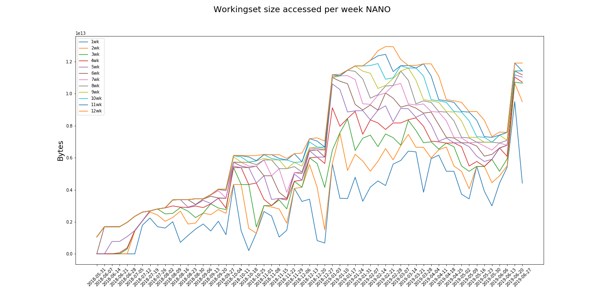
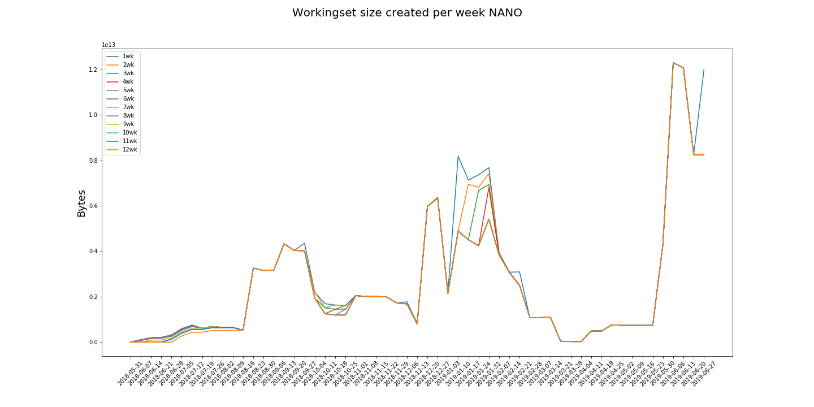
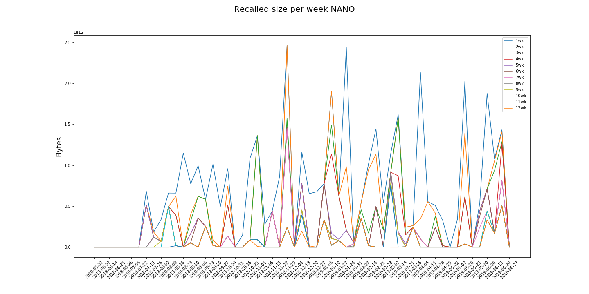
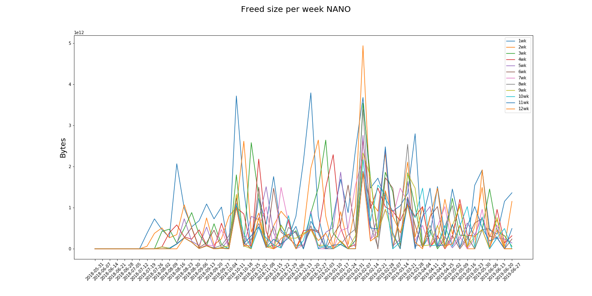
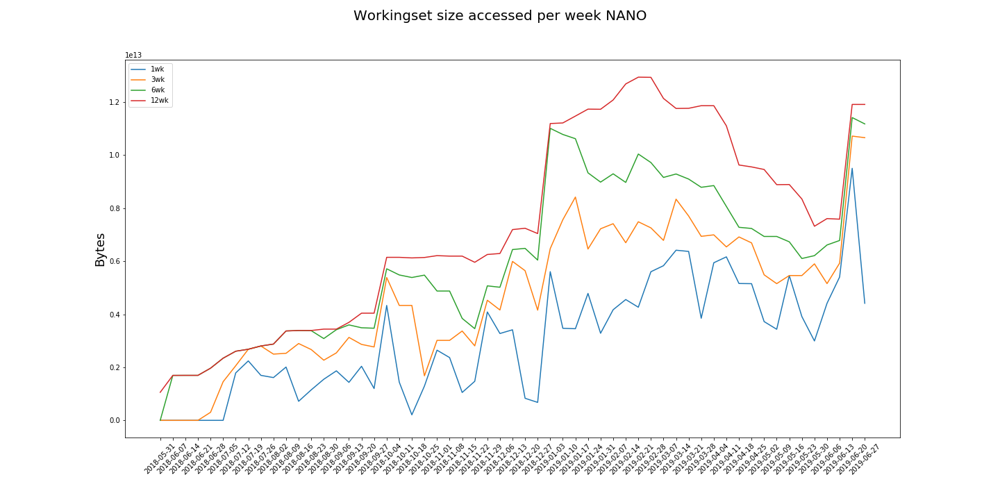
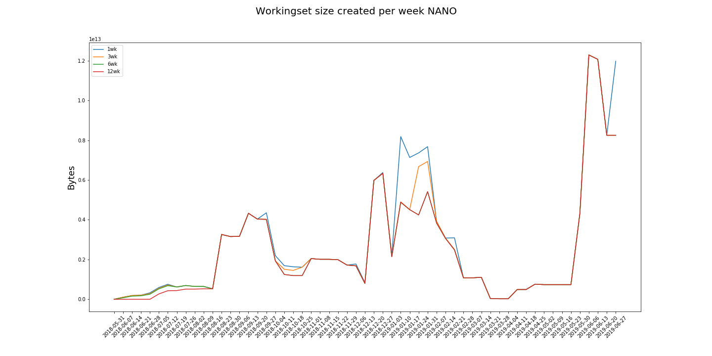
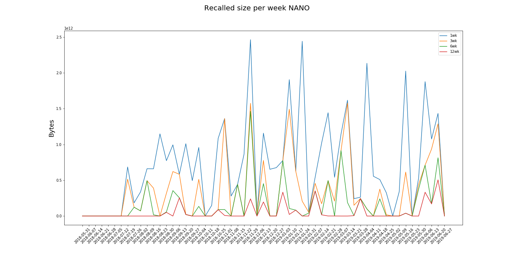
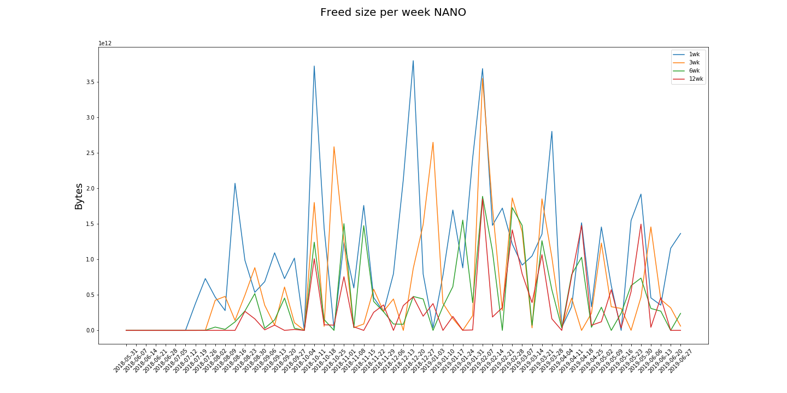

# NANO

The "NANO" category comprises the accesses to those datasets that belong to the datatier NANOAOD.

| policy |max_rec_day          |max_rec_day      |max_ws_c_size|max_ws_a_size  |total_rec      |total_freed
|--------|---------------------|-----------------|-------------|---------------|---------------|-----------
| 1      | 2.21 TB             | 2018-11-30      | 12.29 TB    | 9.50 TB       | 41.11 TB      | 57.12 TB  
| 2      | 2.21 TB             | 2018-11-30      | 12.29 TB    | 10.66 TB      | 26.04 TB      | 40.92 TB  
| 3      | 1.34 TB             | 2019-03-20      | 12.29 TB    | 10.72 TB      | 19.80 TB      | 33.52 TB  
| 4      | 1.21 TB             | 2018-11-30      | 12.29 TB    | 11.04 TB      | 15.21 TB      | 28.88 TB  
| 5      | 1.21 TB             | 2018-11-30      | 12.29 TB    | 11.18 TB      | 11.09 TB      | 24.44 TB  
| 6      | 1.21 TB             | 2018-11-30      | 12.29 TB    | 11.42 TB      | 9.75 TB       | 23.47 TB  
| 7      | 1.20 TB             | 2018-11-30      | 12.29 TB    | 11.42 TB      | 7.78 TB       | 21.26 TB  
| 8      | 794.03 GB           | 2019-03-07      | 12.29 TB    | 11.47 TB      | 5.29 TB       | 18.77 TB  
| 9      | 794.03 GB           | 2019-03-07      | 12.29 TB    | 11.73 TB      | 5.05 TB       | 18.65 TB  
| 10     | 756.39 GB           | 2019-03-07      | 12.29 TB    | 11.88 TB      | 4.63 TB       | 18.25 TB  
| 11     | 756.39 GB           | 2019-03-07      | 12.29 TB    | 12.46 TB      | 4.02 TB       | 18.13 TB  
| 12     | 505.85 GB           | 2019-06-25      | 12.29 TB    | 12.94 TB      | 2.97 TB       | 16.48 TB  

 

 

 

 

## Reduced plots 

The following plots only show policies 1, 3, 6 and 12

 

 

 

 

