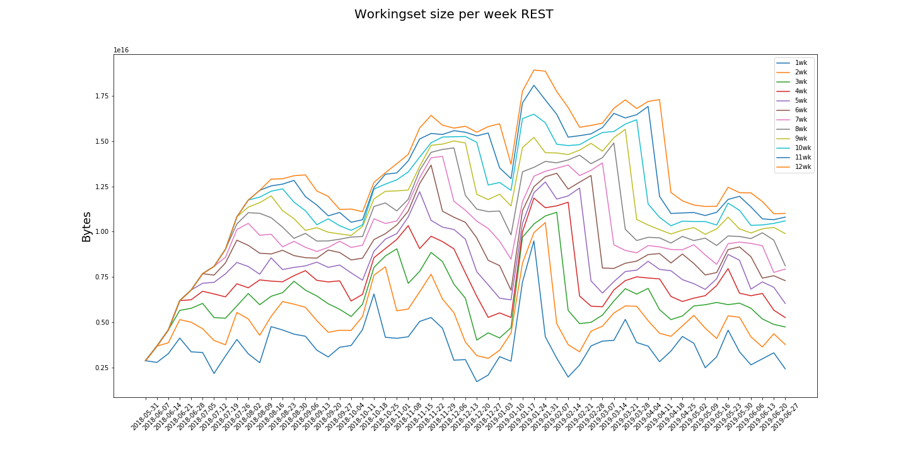
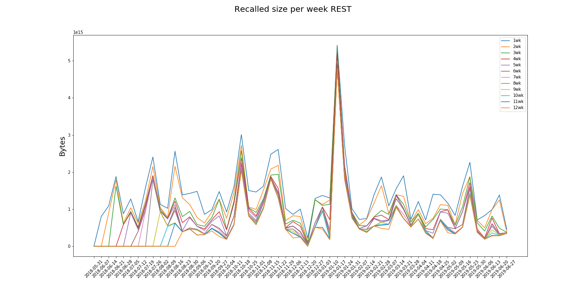
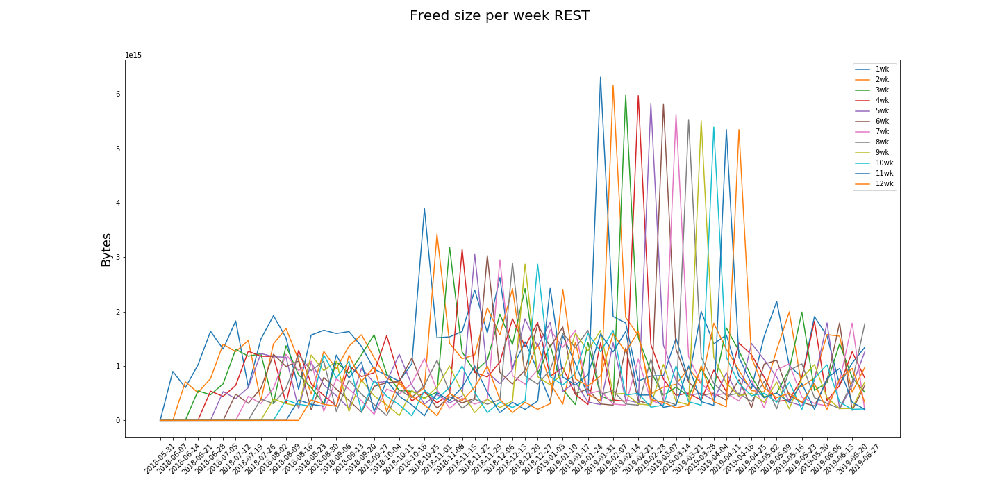

# REST

The "REST" category comprises the accesses to those datasets other than NANOAOD, MINIAOD, MINIAODSIM and AOD

policy |max_recalled_per_day |max_recalled_day |max_workingset_size |total_recalled |total_freed
-------|---------------------|-----------------|--------------------|---------------|-----------
1      | 4.76 PB             | 2019-01-22      | 9.48 PB            | 79.30 PB      | 79.74 PB  
2      | 4.68 PB             | 2019-01-22      | 10.50 PB           | 66.19 PB      | 66.10 PB  
3      | 4.68 PB             | 2019-01-22      | 11.07 PB           | 57.15 PB      | 56.98 PB  
4      | 4.67 PB             | 2019-01-22      | 11.85 PB           | 50.30 PB      | 51.24 PB  
5      | 4.63 PB             | 2019-01-22      | 12.74 PB           | 46.39 PB      | 47.13 PB  
6      | 4.60 PB             | 2019-01-22      | 13.67 PB           | 42.11 PB      | 42.49 PB  
7      | 4.60 PB             | 2019-01-22      | 14.16 PB           | 39.96 PB      | 40.11 PB  
8      | 4.60 PB             | 2019-01-22      | 14.90 PB           | 38.11 PB      | 39.02 PB  
9      | 4.60 PB             | 2019-01-22      | 15.65 PB           | 35.00 PB      | 35.92 PB  
10     | 4.60 PB             | 2019-01-22      | 16.49 PB           | 33.44 PB      | 34.59 PB  
11     | 4.60 PB             | 2019-01-22      | 18.08 PB           | 32.06 PB      | 33.54 PB  
12     | 4.60 PB             | 2019-01-22      | 18.92 PB           | 30.64 PB      | 32.53 PB

 

 

 

